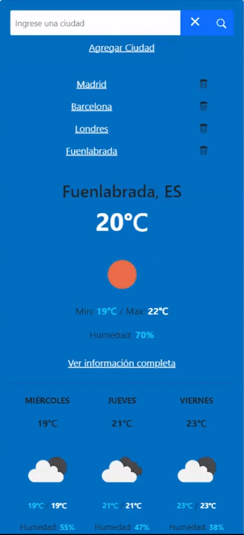
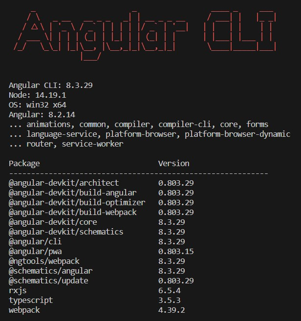

# PwaClima

La aplicación de clima  permite consultar el clima actual y el pronóstico de los próximos días para diferentes ciudades.

## Características

- Consultar el clima actual: La aplicación te permite ingresar el nombre de una ciudad y obtener información sobre la temperatura actual, las condiciones climáticas y la humedad.

- Agregar ciudades: Puedes agregar nuevas ciudades a la lista de ciudades disponibles para consultar su clima. Estas ciudades se guardarán en una lista y podrás seleccionarlas en el futuro.

- Eliminar ciudades: También puedes eliminar ciudades de la lista si ya no deseas consultar su clima.

- Obtener pronóstico: La aplicación muestra el pronóstico para los próximos días. 

- La aplicación utiliza la API de OpenWeatherMap de clima para obtener los datos necesarios. Utiliza servicios para realizar las solicitudes a la API y procesar los datos recibidos.

## Demo

## Requisitos Previos

npm install -g @angular/cli@8.3.29

## Dependencias

pwa-clima@0.0.0 C:\Users\jose.rubio\Documents\PruebaTiempo\pwa-clima
├── @angular-devkit/build-angular@0.803.29
├── @angular/animations@8.2.14
├── @angular/cli@8.3.29
├── @angular/common@8.2.14
├── @angular/compiler-cli@8.2.14
├── @angular/compiler@8.2.14
├── @angular/core@8.2.14
├── @angular/forms@8.2.14
├── @angular/language-service@8.2.14
├── @angular/platform-browser-dynamic@8.2.14
├── @angular/platform-browser@8.2.14
├── @angular/pwa@0.803.15
├── @angular/router@8.2.14
├── @angular/service-worker@8.2.14
├── @types/jasmine@3.3.16
├── @types/jasminewd2@2.0.8
├── @types/node@12.12.47
├── codelyzer@5.2.2
├── jasmine-core@3.5.0
├── jasmine-spec-reporter@5.0.2
├── karma-chrome-launcher@3.1.0
├── karma-coverage-istanbul-reporter@2.1.1
├── karma-coverage@2.0.3
├── karma-jasmine-html-reporter@1.5.4
├── karma-jasmine@3.3.1
├── karma@4.4.1
├── protractor@5.4.4
├── rxjs@6.5.4
├── selenium-webdriver@4.10.0
├── ts-node@8.4.1
├── tslib@1.10.0
├── tslint@5.20.1
├── typescript@3.5.3
└── zone.js@0.9.1

## Instalación

1- Clona el repositorio: git clone <URL del repositorio>
2- Posicionarse en el directorio raiz de la app `PruebaTiempo\pwa-clima`
3- Instala las dependencias: `npm install`

## Construcción

En la carpeta raiz del proyecto crear la build: `npm run prod`

## Uso

1 -Ejecuta la aplicación: `ng serve`
2- Accede a la aplicación en tu navegador: `http://localhost:4200/`

## API

La aplicación  utiliza la API de OpenWeatherMap [https://openweathermap.org/api]

## TECNOLOGÍAS 
- Angular
- NPM
- Bootstrap
- Karma
- Protractor
- Typescript
- HTML5

## Autores

Jose Antonio Rubio Sancho 
Email: jarcla55@gmail.com

## Pruebas

### Pruebas Unitarias

Introduce el comando `ng test --code-coverage` para ejecutar lso test unitarios[Karma](https://karma-runner.github.io).

### Pruebas End-to-End

Introduce el comando `ng e2e` para ejecutar lso test end-to-end [Protractor](http://www.protractortest.org/).

## AYUDA

Si necesitas mas ayudaen Angular CLI usa `ng help` o revisa [Angular CLI README](https://github.com/angular/angular-cli/blob/master/README.md).

